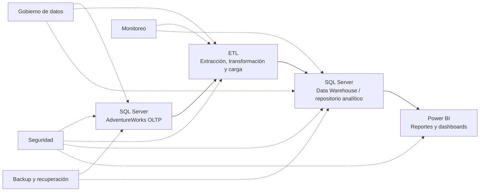

# Diseño de la arquitectura de la solución

## 1. Alcance de este documento

Este documento recopila el diseño conceptual de la arquitectura para la **Entrega 1** del proyecto de reportabilidad de Adventure Works Cycles.

La arquitectura se basa en la propuesta de la slide 5 del material oficial del curso. Por indicación del profesor, se excluye el bloque **4. Cubos de datos (Semántica BI)**. Por lo tanto, el flujo documentado queda compuesto por:

```text
Fuente de datos (OLTP)
        ↓
ETL
        ↓
Repositorio de datos (Data Warehouse)
        ↓
Visualización y dashboards (Power BI)
```

> En la Entrega 1 se diseña la arquitectura. La implementación operativa del ETL, del repositorio OLAP/Data Warehouse y de los reportes finales corresponde a las entregas posteriores, según el enunciado oficial.

## 2. Requisitos oficiales relacionados

El material oficial indica que la plataforma debe:

- tomar datos desde una fuente;
- cargarlos a un almacén de datos;
- desplegar información estratégica en dashboards ejecutivos;
- considerar tres perspectivas: **clientes**, **procesos/producción** y **ventas**;
- incluir al menos cinco reportes por perspectiva;
- implementar los reportes finales en Power BI.

Para la Entrega 1 se solicita específicamente:

1. Diseño de la arquitectura de la solución.
2. Diseño de los reportes solicitados.
3. Base de datos transaccional implementada como fuente de datos.

## 3. Flujo principal de la solución

### 3.1 Fuente de datos: base transaccional OLTP

La fuente corresponde a la base de datos **AdventureWorks**, proporcionada mediante el archivo `Data/AdventureWorks2022.bak`.

La base transaccional contiene información operacional de la organización, incluyendo datos relacionados con:

- ventas;
- clientes y personas;
- productos;
- producción;
- inventario;
- compras;
- recursos humanos.

Para el entorno de desarrollo se contempla ejecutar SQL Server en Docker y restaurar el archivo `.bak`. La base restaurada será utilizada como fuente OLTP para las consultas y procesos posteriores.

**Responsabilidad de esta capa:** registrar y mantener los datos operacionales de la empresa.

### 3.2 ETL: extracción, transformación y carga

La capa ETL representa el proceso que transportará los datos desde la fuente transaccional hacia el repositorio analítico.

Sus etapas conceptuales son:

1. **Extracción:** obtener datos desde SQL Server/AdventureWorks.
2. **Transformación:** limpiar, validar, integrar y aplicar reglas de negocio; además de realizar los cálculos necesarios para el análisis.
3. **Carga:** almacenar los datos transformados en el repositorio de datos.

En esta entrega la capa se deja diseñada conceptualmente. Su implementación operativa se realizará en la Entrega 2.

**Responsabilidad de esta capa:** preparar datos confiables y adecuados para análisis, sin afectar directamente la operación de la fuente.

### 3.3 Repositorio de datos: Data Warehouse

El repositorio de datos será implementado en SQL Server, de acuerdo con la arquitectura de referencia. Su propósito será centralizar los datos integrados provenientes de la fuente y dejarlos disponibles para análisis histórico.

Características esperadas según la propuesta del curso:

- modelo orientado al análisis;
- integración de información de distintas áreas;
- conservación de históricos;
- controles de calidad de datos;
- optimización para consultas y reportabilidad.

El modelo dimensional y la implementación del repositorio se desarrollarán en la Entrega 2. En la Entrega 1 solo se define su función dentro de la arquitectura.

**Responsabilidad de esta capa:** servir como repositorio analítico estable para el consumo de reportes.

### 3.4 Visualización y dashboards: Power BI

Power BI será la herramienta de visualización y consumo de información. Se conectará al repositorio de datos para construir reportes ejecutivos e interactivos.

Los reportes se organizarán en las tres perspectivas solicitadas:

- clientes;
- procesos/producción;
- ventas.

Cada perspectiva deberá contar con al menos cinco reportes diseñados. La implementación final de estos reportes corresponde a la Entrega 3, mientras que su diseño forma parte de la Entrega 1.

**Responsabilidad de esta capa:** presentar indicadores, tendencias y análisis que apoyen la toma de decisiones.

## 4. Capas transversales

La slide 5 también propone capacidades que atraviesan las distintas etapas de la solución. Se consideran como lineamientos de diseño:

### Seguridad

- control de acceso;
- roles y permisos;
- seguridad a nivel de fila cuando sea necesario.

### Gobierno de datos

- diccionario de datos;
- trazabilidad o linaje de datos;
- controles de calidad y auditoría.

### Monitoreo

- seguimiento de la ejecución de procesos ETL;
- control de rendimiento;
- generación de alertas ante fallos.

### Backup y recuperación

- respaldos periódicos;
- recuperación ante fallos;
- disponibilidad de la información.

Estas capacidades se documentan como parte de la arquitectura objetivo. Su nivel de implementación dependerá de la etapa del proyecto y no implica construir todas sus funcionalidades durante la Entrega 1.

## 5. Decisiones y exclusiones para la Entrega 1

### Decisiones adoptadas

- Se utilizará AdventureWorks como fuente transaccional.
- SQL Server será el motor de la fuente y del repositorio propuesto.
- Docker se utilizará como entorno local para ejecutar SQL Server.
- Power BI será la herramienta de visualización final.
- El flujo principal no contempla cubos de datos ni una capa independiente de semántica BI.

### Fuera del alcance actual

No se implementan todavía:

- procesos ETL operativos;
- Data Warehouse final;
- cubos OLAP o semántica BI independiente;
- medidas DAX definitivas;
- dashboards finales en Power BI.

## 6. Justificación de la arquitectura

La arquitectura separa la operación, el procesamiento, el almacenamiento analítico y la visualización. Esta separación permite conservar la fuente transaccional enfocada en sus operaciones, preparar los datos mediante ETL y entregar a Power BI una estructura orientada al análisis.

La eliminación del bloque de cubos de datos simplifica el flujo solicitado para este proyecto y deja a Power BI como capa de consumo directo del repositorio analítico, manteniendo las etapas esenciales indicadas en la propuesta del profesor.

## 7. Diagrama resumido



## 8. Referencia consultada

- `Docs/Ing.Datos.Big.Data - Proyecto Entregable 1.pdf`, especialmente las páginas 4 a 7 y la slide 5: **Arquitectura de la solución**.

## 9. Diagrama editable

El diagrama editable compatible con diagrams.net/draw.io se encuentra en [arquitectura-solucion-entrega-1.drawio](./arquitectura-solucion-entrega-1.drawio).
